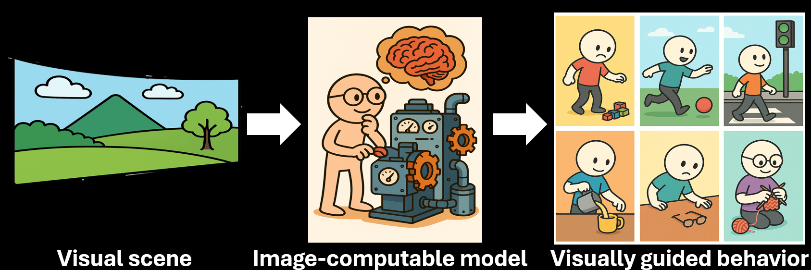

I am a postdoctoral researcher in the Laboratory of Psychophysics ([LPSY](https://www.epfl.ch/labs/lpsy/)) at EPFL. You can reach me at [cnoluk@gmail.com](mailto:cnoluk@gmail.com). Here is my [CV](http://canoluk.github.io/files/CV_CanOluk.pdf); for more, see [about me](https://canoluk.github.io/about_me/).

 My research focuses on building image-computable models to explain how the human visual system extracts information from the physical world to guide action across tasks such as slant perception, motion direction estimation, and target detection ([Google Scholar](https://scholar.google.com/citations?user=NwCzTz8AAAAJ&hl=tr&oi=ao), [models](https://github.com/CanOluk)). In particular, I extend principled, interpretable models (e.g., Bayesian ideal observers) to relatively complex tasks and test their generalisability across task variations. I am also interested in theory of model selection; see my [Research](https://canoluk.github.io/research/).

  

Beyond visual perception, I am broadly interested in human behaviour and its underlying neural mechanisms (e.g., confidence and consciousness).

